class: hide-footer, hide-count
background-color: #EFEFEF

```{r, include = FALSE}
library(fontawesome)
library(tidyverse)
library(knitr)
knitr::opts_chunk$set(echo = FALSE, comment = "")
```


.pull-left[

# Statistik leicht gemacht mit

```{r, fig.align = "center"}
knitr::include_graphics("libs/_Images/logo-R.png")
```
]

.pull-right[
<br><br>
## Hands-On Tutorial

```{r, fig.align = "center", out.width = "100%", out.height = "100%"}
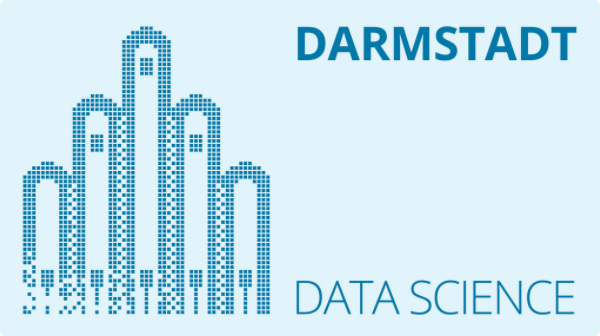
```
]

.left-column[<br><br><br>`` ``14. März 2022]
.right-column[
.pull-left[Wolf Riepl - R Trainer]
.pull-right[Youtube: StatistikinDD]
.pull-left[https://statistik-dresden.de]
.pull-right[Twitter: @StatistikinDD]
]

---

class: agenda, inverse

# Agenda

### .yellow[*1. Kurzer Einstieg in R und RStudio*]
### 2. Automatisierte Berichte mit R: Das Markdown-Format
### 3. Statistik mit R leicht gemacht
### 4. Ergänzungen

???

* Zuerst Pakete installieren, dann einleitende Folien
* Gemeinsam stricken

R-Code schreiben, ja - aber dank moderner Erweiterungspakete kann man viel Cooles mit ein oder zwei Codezeilen erreichen

---

layout: true

# Erstes Date: R und RStudio

---

## Warum R?

> R ist die weltweit leistungsstärkste Programmiersprache für statistische Berechnungen, maschinelles Lernen und Grafiken und steht gleichzeitig für eine blühende globale Gemeinschaft von Anwendern, Entwicklern und Beitragenden.

--

** *Das sagt ausgerechnet - Microsoft!* ** Microsoft R Application Network (MRAN)

* Über 18.000 Erweiterungspakete allein auf CRAN  
  (Comprehensive R Archive Network)
* Weitere Pakete u. a. bei github und auf bioconductor.org
* Online gibt es Antworten auf nahezu jede denkbare R-Frage, z. B. bei **stackoverflow**
* Sehr aktive Community: Twitter #RStats, RBloggers

---

## Warum R? Einige Konzerne, die R einsetzen

.pull-left[


```{r, out.width = "15%", out.height = "15%"}

```

```{r, out.width = "25%", out.height = "25%"}

```

]

.pull-right[
* u. a. zur Verhaltens-Analyse (Status-Updates, Profilbilder);  
Visualisierung großer Datenmengen  
<br>
  
* Werbewirksamkeit; ökonomische Prognosen;  
statistische Modellierung (Big Data)  
<br><br>
  
* Datenvisualisierung, Semantische Analysen
<br><br><br>

* Data Science


]

---

.pull-left[

## Warum R? Popularität

* Sehr populär für eine **domänen-spezifische Sprache**
* ABER:

```{r, out.height = "85%", out.width = "85%"}
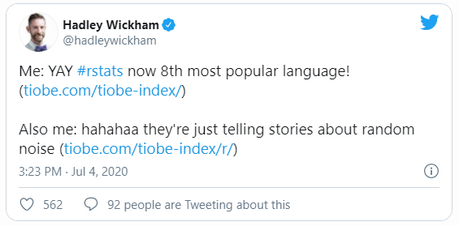
```

Tiobe Index: Starke Schwankungen  
z. B. R auf Platz 8 (08/2020) vs. 19 (09/2019)

]

.pull-right[
```{r, out.width = "74%", out.height = "74%"}
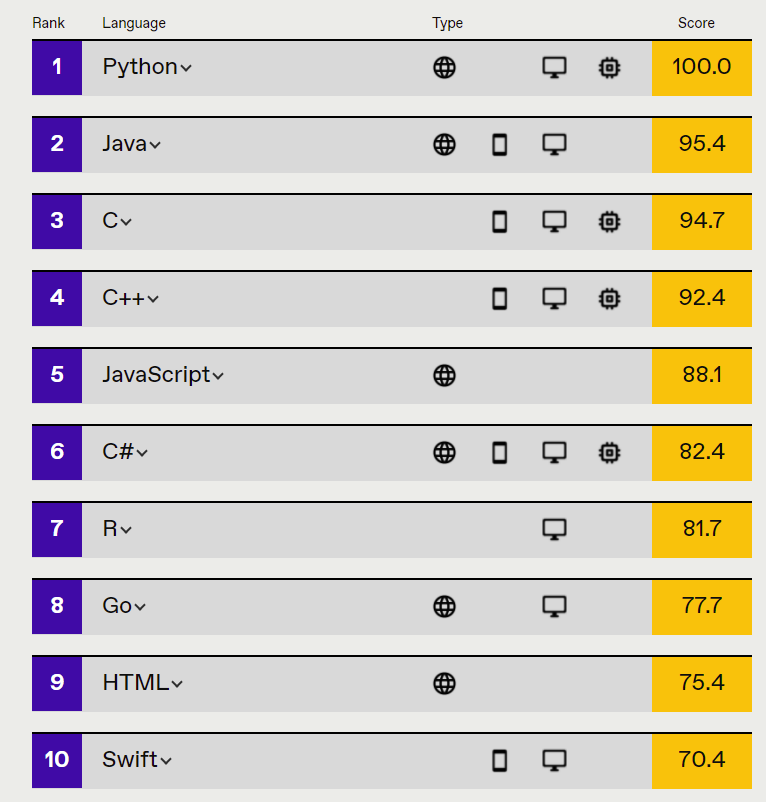
```

* IEEE = *Institute of Electrical and Electronics Engineers* **2021**; 
https://spectrum.ieee.org/top-programming-languages/
* 11 Metriken von github, Google, Stack Overflow, Twitter etc.
* Nicht in Top 10: PHP, SQL, Ruby, Rust, Julia

]
---

## Ein kuzer Blick in die Geschichte

.large[
* R ist eine Implementierung der Programmiersprache S
* S wurde von John Chambers (Bell Labs) entwickelt; erste Veröffentlichung (S1) 1976
* **Ross Ihaka** und **Robert Gentleman** entwickelten R ab 1992; Verbreitung ab 1993
* Weiterentwicklung durch R Core Team (https://www.r-project.org/contributors.html) seit 1997
* R Foundation for Statistical Computing (Wirtschaftsuniversität Wien)
* GNU (General Public License)
* R ist gleichzeitig eine Programmiersprache und eine Entwicklungsumgebung
]

.center[]

---

## Grundprinzipien: Wie tickt R?

.pull-left[
* Überwiegend programmiert in R, C, Fortran

* Funktionales Programmieren und <br>Objektorientiertes Programmieren:

> "Alles, was existiert, ist ein Objekt.  
Alles, was passiert, ist ein Funktionsaufruf."

<br>.right[
John Chambers  
Entwickler von S und Mitglied von R Core
]]

.pull-right[
.right[]  

]

---

### Starkes Entwicklerteam, unter anderen:

Hadley Wickham | Jenny Bryan | Max Kuhn | Garrett Grolemund
---------------|-------------|----------|------------------
 |  |  | 
Über 130 R-Pakete | ROpenSci: reproduzierbare Forschung; R Foundation | Pakete: tidymodels;<br>älter: caret, C50 | Zahlreiche Webinare
Initiator des *tidyverse* | Bücher: Happy Git; R Packages | Buch: Tidy Modeling with R (mit Julia Silge) | Buch: R for Data Science
Bücher: R for Data Science; Advanced R; ggplot2;<br>R Packages | "... dann komme ich in Ihr Büro und zünde Ihren Computer an 🔥" | Buch: Feature Engineering and Selection (mit Kjell Johnson) | Buch: Hands-On Programming with R

---

### Starkes Entwicklerteam, unter anderen:

Mara Averick | Yihui Xie | Thomas Pedersen | Winston Chang
-------------|-----------|-----------------|--------------
 | 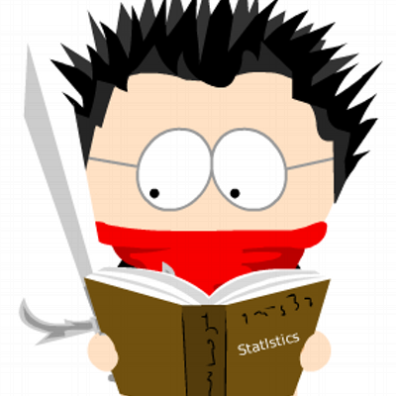 |  | 
tidyverse-Entwicklerin | R-Pakete: knitr, animation, bookdown, blogdown, xaringan | gganimate, zahlreiche ggplot2-Erweiterungen | Shiny, R6; Mitarbeit an ggplot2, devtools
\> 40.000 Twitter-Follower | Bücher: R Markdown, Blogdown, Bookdown | arbeitet u. a. an Beschleunigung von Grafik-Paketen | R Graphics Cookbook

---

## Empfohlene Entwicklungsumgebung für R

* *Es gibt Alternativen, z. B. R Tools für Visual Studio; vim*

* Team entwickelt auch **Shiny** (Tool für interaktive Webapplikationen mit R)
* Kontinuierliche Weiterentwicklung;  
*Empfehlung: RStudio regelmäßig updaten!*

* Leistungsfähige Open-Source-Version

* Bei wachsenden Anforderungen skalierbar:
  + RStudio Desktop Server (kostenlos)
  + RStudio Desktop Pro (kostenpflichtig)
  + RStudio Workbench (kostenpflichtig)

---

layout: false

# Erstes Date: R und RStudio - Projekte

```{r, fig.align = "center", out.width = "40%", out.height = "40%"}
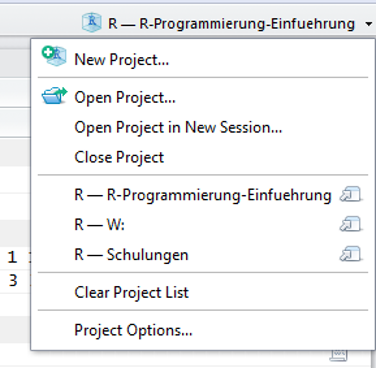
```

** Projektspezifische Arbeitsumgebung mit Skripten, Daten, Befehlsgeschichte**


---
class: agenda, inverse

# Agenda

### 1. Kurzer Einstieg in R und RStudio
### .yellow[*2. Automatisierte Berichte mit R: Das Markdown-Format*]
### 3. Statistik mit R leicht gemacht
### 4. Ergänzungen


---
layout: true

# Automatisierte Berichte mit R

---

## Warum? Houston, wir haben ein Problem!

```{r, out.height = "60%", out.width = "60%", fig.align = 'center'}
knitr::include_graphics("libs/_Images/markdown-houston.png")
```

---

## Warum? Reproduzierbarkeit von Studien, Datenanalysen

#### Schätzungen

* 75% - 90% prä-klinischer Studienergebnisse nicht reproduzierbar
* Kosten für bio-medizinische Firmen in den USA pro Jahr: 28 Mrd. USD

Quelle: Vortrag von Garrett Grolemund, EARL-Konferenz, London

Video: https://www.youtube.com/watch?v=HVlwNayog-k


#### Reproduzierbare Ergebnisse dank RMarkdown!

---

## Word, PDF, Powerpoint, .green[HTML]

.pull-left[

* Markdown: einfache Auszeichnungssprache („Markup“-Sprache)  
Weitere Markup-Sprachen: HTML, XML  
* R-Paket **rmarkdown** seit 2014
* Word-Dokumente erfordern MS Word-Installation
* PDF-Dokumente:
  + LaTeX-Installation: **TinyTex** (Alternative: MiKTeX)
  + Oder HTML aus Browser als PDF drucken bzw. `pagedown::chrome_print()`

* .green[**Empfehlung: HTML für interaktive Elemente!**]
* Es gibt verschiedene HTML-Formate, inklusive mehreren Präsentations-Varianten
  + Mein Favorit: .blue[**xaringan**]
]

.pull-right[
```{r markdown-logo, echo = FALSE, out.width = "60%", out.height = "50%", fig.align = "right"}

```
]

---

## Vorlagen unter File - New File - R Markdown

.pull-left[

```{r markdown-vorlage, echo = FALSE, out.width = "85%", out.height = "85%"}
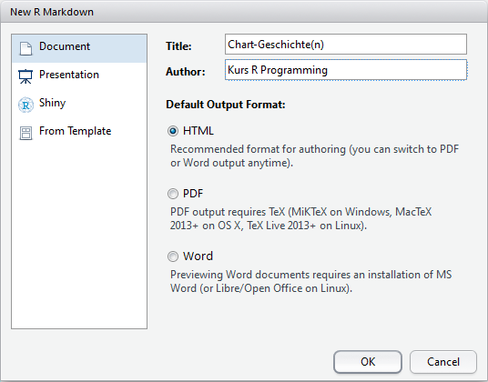
```

]

.pull-right[

Jederzeit zwischen HTML, PDF, Word wechseln: im YAML-Header

* output: html_document
* output: word_document
* output: pdf_document

Oder:

```{r knit-to, echo = FALSE, out.width = "40%", out.height = "40%"}
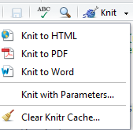
```

]

---

## YAML Header

* Enthält Meta-Informationen, z. B. Titel, Autor, Datum, Ausgabeformat
* YAML Ain‘t Markup Language <- Yet Another Markup Language
* Gekennzeichnet mit jeweils drei	---	am Anfang des Dokuments
* Grundgerüst kann aus RStudio-Vorlage übernommen und angepasst werden

**Knit:** Dokument aus .Rmd-Vorlage erstellen

```{r yaml, echo = FALSE, out.width = "70%", out.height = "70%"}
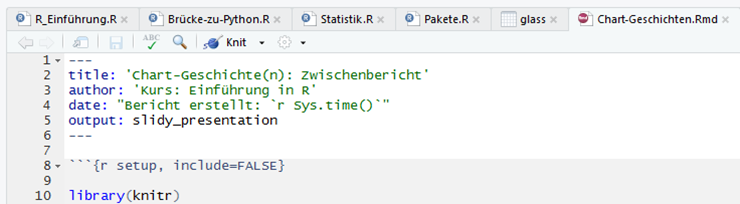
```

---

## R-Code und Text mischen

```{r R-Text-Code, echo = FALSE, out.width = "100%", out.height = "100%"}
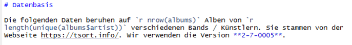
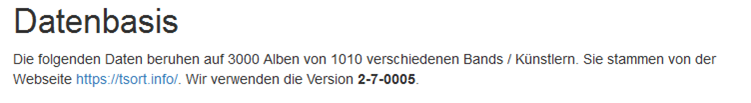
```

---

## R-Code und Text mischen

.pull-left[

Markdown-Code | Ergebnis
--------------|---------
*'r R-code'*  |	R-Code in laufenden Text einbetten,<br>z. B. „Die Daten beruhen auf 'r nrow(albums)' Alben.“
#<br>##| Überschrift 1 <br> Überschrift 2 … usw.
\*Text*<br>\_Text_          | *Kursivschrift*
\*\*Text**<br>\_\_Text__    | **Fettschrift**

]

.pull-right[
Markdown-Code | Ergebnis
--------------|---------
\* Punkt 1<br>\* Punkt 2<br> <center> + P 2.1 | Nicht nummerierte Liste
1. Punkt 1<br>2. Punkt 2 | Nummerierte Liste

Weitere Formatierungen siehe:
* https://rmarkdown.rstudio.com/authoring_basics.html
* Markdown Quick Reference in der RStudio-Hilfe

]
   
---

## R Codeblock

```{r Codeblock, echo = FALSE, eval = FALSE}

library(tidyverse)
ggplot(diamonds, aes(x = carat, y = price, color = color)) +
  geom_point() + 
  theme_dark()

```

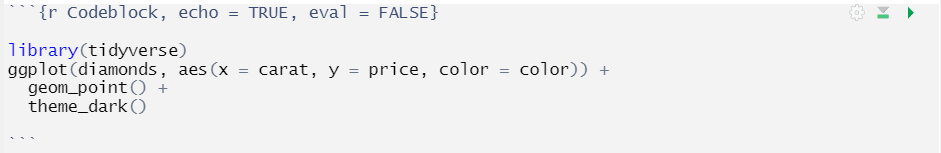

* Beginnt mit ```` ```{r} ````
* endet mit ```` ``` ```` 
* Wird von R Studio automatisch grau hinterlegt
* Empfehlung: benennen; hier: *Codeblock*; jeder Name muss eindeutig sein
* echo = TRUE:	Codeblock im fertigen Dokument anzeigen; Alternative: FALSE
* eval = FALSE: Code nicht evaluieren (d. h. hier erscheint Code, aber kein Diagramm)
* Tastaturkürzel: **Strg + Alt + I** fügt Codeblock ein

---

## Chunk-Optionen

.large[
Für weitere Chunk-Optionen neben *echo* und *eval* siehe https://yihui.org/knitr/options/

* Einstellungen für Grafiken, z. B. fig.width, fig.height

* Caching, d. h. Zwischenspeichern von Codeblöcken für schnellere Ausführung

* Umgang mit Fehlern (anzeigen vs. abbrechen) und Warnungen, Messages (anzeigen vs. unterdrücken)

* Animationen
]

---

## Literatur

.pull-left[
```{r Markdown-book, echo = FALSE, fig.show = "hold", out.width = "45%", out.extra = 'style="border:10px solid white;"'}

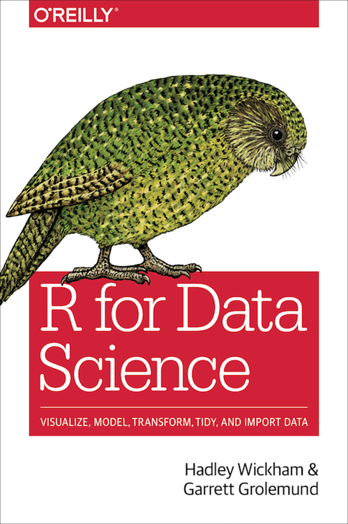
```
]

.pull-right[
Beide Bücher sind online kostenlos lesbar

* [R Markdown: The Definitive Guide](https://bookdown.org/yihui/rmarkdown/)
* [R for Data Science](https://r4ds.had.co.nz/index.html)
	Kap. 27, 29, 30

Hilfe in RStudio

* Help – Markdown Quick Reference
* Help – Cheatsheets:  
R Markdown Cheat Sheet  
R Markdown Reference Guide

]

---

## Ausblick: Bookdown - Bücher direkt aus R

.pull-left[
* R-Paket von **Yihui Xie** (knitr, animation)

* Grundlage: Markdown
* Dynamische Bearbeitung
* Flexible Outputs, z. B. PDF auf Knopfdruck
* Einfachere Auszeichnungssprache als LaTeX
* Online-Veröffentlichung, z. B. auf GitHub, bookdown.org, beliebiger Webserver
* Online-Veröffentlichung ermöglicht interaktive Inhalte:  
Shiny-Apps, HTML-Widgets, Animationen

https://bookdown.org/

]

.pull-right[
```{r bookdown, echo = FALSE, out.width = "55%", out.height = "55%"}
knitr::include_graphics("libs/_Images/cover-bookdown.jpg", )
```

]

---

## Ausblick: Blogdown - Websites / Blogs direkt aus R

.pull-left[
* R-Paket von **Yihui Xie** (knitr, animation)

* Erzeugt statische Webseite:
  + HTML, CSS, JavaScript, Bilder, ...
  + Kein PHP, keine Datenbank, keine serverbasierte R-Installation erforderlich

* Grundlage: Markdown
  + Dynamische Bearbeitung
  + Flexible Outputs, z. B. PDF, Buch, etc.
  
https://bookdown.org/yihui/blogdown/
]

.pull-right[
```{r blogdown, echo = FALSE, out.width = "57%", out.height = "57%"}
knitr::include_graphics("libs/_Images/cover-blogdown.png", )
```

]

---

## Ausblick: Dashboards mit R und Markdown

.pull-left[
### Das flexdashboard-Paket

* Baut auf Markdown auf, HTML-Format
* Responsiv
* Unterstützt *value boxes* und *gauges* (Kästchen und Armaturen-Displays wie im Auto)
* Flexible Layouts: Zeilen und Spalten einfach definieren
* *Storyboards*: Grafiken und zentrale Befunde übersichtlich darstellen
* Interaktive Elemente: HTML-Widgets, optional Shiny-Apps

https://pkgs.rstudio.com/flexdashboard/
]

.pull-right[
```{r}
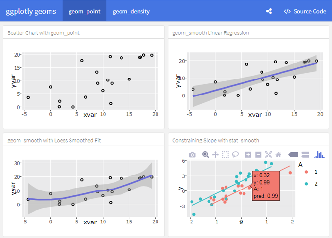
```
]

---

## Ausblick: Shiny

.pull-left[

* Interaktive App, die auf Nutzereingaben reagiert

* Benötigt R während der Laufzeit:

  + Lokale R-Session *oder*
  + Serverbasierte R-Session (Webseite)

* In Markdown-Dokumente einbetten oder als alleinstehende App
  
Shiny lernen:

  + RStudio-Webseiten: https://shiny.rstudio.com/
  + Buch von Hadley Wickham: [Mastering Shiny](https://mastering-shiny.org/)
]

.pull-right[
```{r, echo = FALSE, out.width = "70%", out.height = "70%"}
knitr::include_graphics("libs/_Images/cover-mastering-shiny.png")
```
]


---

layout: false
class: agenda, inverse

# Agenda

### 1. Kurzer Einstieg in R und RStudio
### 2. Automatisierte Berichte mit R: Das Markdown-Format
### .yellow[*3. Statistik mit R leicht gemacht*]
### 4. Ergänzungen


---
layout: true

# Statistik mit R leicht gemacht

---

## Lang lebe die Nullhypothese ...

.pull-left[
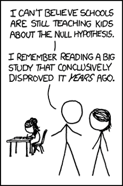
]

.pull-right[
Quelle: xkcd 892  
https://xkcd.com/892/
]

---

## Daten: Das chartmusicdata-Paket

.pull-left[
#### https://tsort.info/ "The World's Music Charts"
  + Songs und Alben von 1900 bis 2018
  + Punktesystem gut geeignet für Einträge bis etwa 2012

#### https://chart2000.com/ "Music Charts 2000 - 2021"
  + Punktesystem besser für aktuellere Einträge

#### Einmalig installieren; in jeder R-Session bei Bedarf laden

```{r, eval = FALSE, echo = TRUE}
# install.packages("devtools")
library(devtools)
install_github("fjodor/chartmusicdata")
```

```{r}
library(chartmusicdata)
data("topalbums")
```
                        
 
]

.pull-right[

Datensatz | Quelle: tsort.info
----------|-------
charts | Alle Songs und Alben von tsort.info von 1900 bis 2018
topsongs | Top 5000 Songs
topalbums | Top 3000 Alben

<br><br>

Datensatz | Quelle: chart2000.com
----------|-----------------------
songs2000 | Top 50 Songs jedes Monats von Januar 2000 bis Juni 2021
albums2000 | Top 50 Alben jedes Monats von Januar 2000 bis Juni 2021

]
---

## Die topalbums-Daten

```{r, echo = TRUE, eval = FALSE}
head(topalbums, n = 3)
```

```{r, echo = FALSE, eval = TRUE}
head(topalbums, n = 3) |> knitr::kable()
```

--

.pull-left[
* position: Platzierung, von 1 bis 3000
* artist: Künstler / Band
* name: Album-Titel
* year: Jahr der Veröffentlichung
* final_score: Gesamt-Punkte, gewichtet nach Region und Jahr
]

.pull-right[
* raw_usa: Rohpunkte USA
* raw_eng: Rohpunkte in den restlichen englischsprachigen Ländern
* raw_eur: Rohpunkte in den restlichen (nicht-englischsprachigen) europäischen Ländern
* raw_row: Rohpunkte im Rest der Welt (ohne Europa, ohne englischsprachige Länder)
]


---

## Erscheinungsjahr vs. Über / Unter 5 Punkten

**Forschungsfrage:** Gibt es Unterschiede im durchschnittlichen Alter (Erscheinungsjahr)  
.indent[.indent[zwischen Alben, die über / unter 5 Punkten (~ Median) erreichten?]]

--

**Hypothese:** Alben, die über 5 Punkte erreichten,	sind durchschnittlich älter als Alben, die weniger als 5 Punkte erreichten.

--

**Begründung:**	Mehr Zeit für Chartplatzierungen; „Oldies“ waren langlebiger?

--

**Methode:** t-Test für unabhängige Stichproben  
.indent[.indent[*Statistik – Mittelwerte vergleichen*]]

**Begründung der Testauswahl:**
* keine Messwiederholung
* keine paarweise Zuordnung der Gruppenelemente -> unabhängige Stichproben

```{r ueber-5-punkte}
topalbums <- topalbums %>% 
  mutate(ueber5 = ifelse(final_score > 5, "> 5 P", "< 5 P"))

```

---

## t-Test: Ergebnisse *elegant* weiterverarbeiten

### Bericht in Textform (englisch): easystats / report

.pull-left[

```{r report, echo = TRUE, eval = FALSE}
library(report)
my_test <- t.test(year ~ ueber5,
   alternative = 'greater',
   conf.level = .95, var.equal = FALSE,
   data = topalbums)
report(my_test) #<<
```

```{r report-wrap, message = FALSE, warning = FALSE}
library(report)

my_test <- t.test(year ~ ueber5,
   alternative = 'greater', #<<
   conf.level = .95, var.equal = FALSE,
   data = topalbums)

report(my_test) %>% 
  stringr::str_wrap(width = 50) %>% 
  cat()
```

]

.pull-right[

```{r, out.height = "40%", out.width = "40%"}
knitr::include_graphics("libs/_Images/logo-report.png")
```
* Kennwerte, die über die Standard-Ausgabe des t-Tests hinausgehen: **Effektstärken**
* Teil der **easystats**-Paketsammlung
]

---

## t-Test: Ergebnisse *elegant* weiterverarbeiten

.pull-left[
### Visualisierung: ggstatsplot

```{r ggstatsplot, eval = FALSE, echo = TRUE}
library(ggstatsplot)
ggbetweenstats(topalbums, #<<
  x = ueber5, y = year,
  title = "Jahr vs. Über / Unter 5 Punkte",
  caption = "Datenquelle: tsort.info")

```

* Boxplot
* Violin-Plot
* Einzelne Datenpunkte
* Angereichert mit statistischen Kennzahlen

]

.pull-right[
```{r, ref.label = "ggstatsplot", out.width = "95%", out.height = "95%", message = FALSE, }
```

]

---

## Korrelationsanalyse

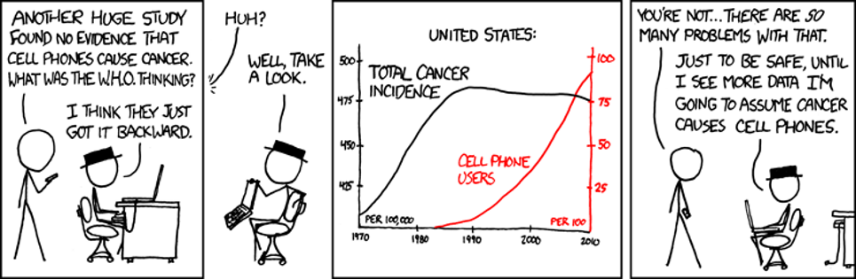

Quelle: http://xkcd.com/925/

---

## Korrelationsanalyse

.pull-left[

### Korrelation zwischen Rohpunkten USA und Rohpunkten Europa

```{r, echo = TRUE}

Korrelation <- cor.test(topalbums$raw_usa, #<<
                        topalbums$raw_eur) #<<

```
]

.pull-right[

### Text-Interpretation

```{r, echo = TRUE, eval = FALSE}
report(Korrelation) #<<
```

```{r}
report(Korrelation) %>% 
  stringr::str_wrap(width = 45) %>% 
  cat()
```


]

---

.pull-left[
## Korrelation grafisch

```{r ggscatterstats, echo = TRUE, eval = FALSE}
ggscatterstats(data = topalbums, #<<
    x = raw_usa, y = raw_eur) #<<
```

### Simple Syntax - informative Ausgabe!

* Streudiagramm: bivariate Verteilungen
* Dichte + Histogramm: *"marginal densigram"* - Verteilungen 
* Anpassungsgerade mit Konfidenzband: Linearer Zusammenhang?
* Korrelationskoeffizient *Pearson's r*
* t-Wert, p-Wert, Konfidenzintervall für r, Fallzahl
* Bayes Factor
]

.pull-right[
```{r, ref.label = "ggscatterstats", message = FALSE, warning = FALSE, out.width = "100%", out.height = "100%", dpi = 300}
```

]

---

## Regressionsanalyse

.pull-left[

* Nimmt im Gegensatz zur Korrelation eine Wirkungsrichtung an
* Unterscheidung zwischen **unabhängigen Variablen** *(Prädiktoren, Regressoren)* und **abhängiger Variable** *(Zielgröße, Regressand)*

```{r reg1, echo = TRUE}
reg <- lm(raw_eur ~ raw_usa, #<<
          data = topalbums) #<<
reg
```

]

.pull-right[
* Im R Commander zusammenklicken unter `Statistik - Modelle anpassen - Lineare Regression`
* In Base R ist die direkte Ausgabe (`reg`) minimal: sie gibt lediglich die Koeffizienten an

]

---

## Regressionsanalyse: `summary()`

.small[
```{r reg2, echo = TRUE}
summary(reg) #<<
```
]

---

## Regressionsanalyse: Text-Interpretation mit dem report-Paket

```{r report-reg, echo = TRUE, eval = FALSE}
report::report(reg) #<<
```

```{r, message = FALSE}
report(reg) %>% 
  stringr::str_wrap(width = 90) %>% 
  cat()
```

---

### Normalverteilung: Voraussetzung parametrischer Tests wie t-Test

.pull-left[
#### Statistisch

```{r, echo = TRUE}
shapiro.test(
  topalbums$final_score
)
```

#### Grafisch

```{r gghistostats, echo = TRUE, eval = FALSE}
ggstatsplot::gghistostats(
  topalbums, final_score,
  normal.curve = TRUE)
```

]

.pull-right[
```{r, out.width = "94%", out.height = "94%"}
ggstatsplot::gghistostats(
  topalbums, final_score,
  normal.curve = TRUE) +
  theme_bw(base_size = 18)
```

]

---

## Zur Interpretation von p-Werten ...

```{r, fig.align = "center", out.width = "25%", out.height = "25%"}
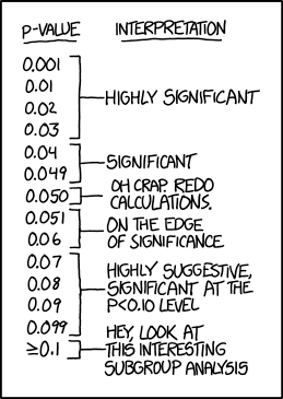
```

Quelle: https://xkcd.com/1478/

---

## Die easystats-Paketsammlung

.pull-left[
```{r}
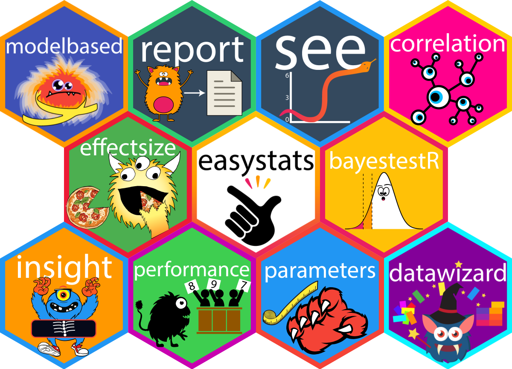
```
]

.pull-right[.large[
* https://github.com/easystats/easystats  

* https://easystats.github.io/blog/
]]

---

## Data Mining-Beispiel: Titanic

.pull-left[
## Wurden Frauen und Kinder zuerst gerettet?

* Daten zu 891 Passagieren (Trainingsdaten für maschinelles Lernen)
* Variablen:
  + Abhängige Variable (AV): Überlebt ja / nein
  + Unabhängige Variablen (UV): Alter, Geschlecht, Passagierklasse (1-3)
* Wie hängen Alter, Geschlecht und Passagierklasse mit den Überlebenschancen zusammen?
* Ziel: Ein Ergebnis, das auch Nicht-Statistikern leicht erklärt werden kann
]

.pull-right[
```{r}
knitr::include_graphics("libs/_Images/titanic.jpg")
```

Der Untergang der Titanic  
Gravur von Willy Stöwer  
Quelle: Wikimedia Commons
]

---

.pull-left[
```{r, out.width = "70%", out.height = "70%"}
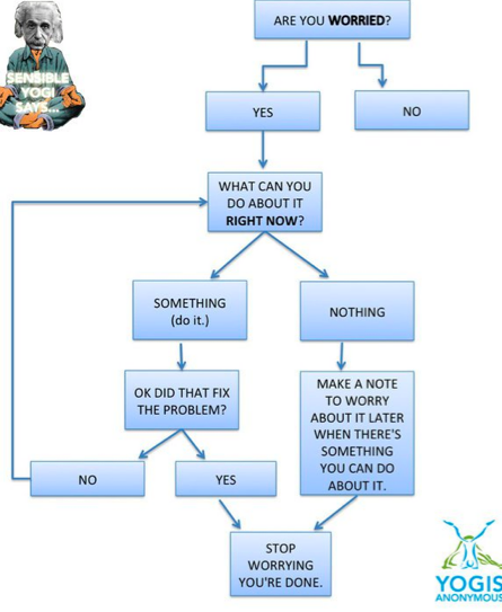
```

]
.pull-right[
### Entscheidungsbaum

* Leicht interpretierbar
* Nicht nur für Yogis geeignet

Quelle: https://elephantjournal.com
]

---

```{r titanic-dataprep, echo = FALSE}

library(titanic)
titanic <- titanic_train
titanic <- titanic %>% 
    select(Survived, Pclass, Sex, Age) %>% 
    rename(Alter = Age,
           Passagierklasse = Pclass,
           Geschlecht = Sex) %>% 
    mutate(Survived = as.factor(Survived),
           Survived = fct_recode(Survived,
                        Ertrunken = "0",
                        Gerettet = "1"),
           Geschlecht = fct_recode(Geschlecht,
                            weiblich = "female",
                            männlich = "male"),
           Passagierklasse = as.factor(Passagierklasse),
           Passagierklasse = fct_recode(Passagierklasse,
                                '1. Klasse' = "1",
                                '2. Klasse' = "2",
                                '3. Klasse' = "3"))
```

```{r rpart, fig.width = 11, fig.height = 7, message = FALSE}
library(rpart)
tree <- rpart(Survived ~ ., #<<
              data = titanic,
              method = "class")

rattle::fancyRpartPlot(tree,
          palettes = c("Greys", "Greens"),
          sub = "", tweak = 1.2)

```

---

.pull-left[
### Interpretation

* Ausgangspunkt: Knoten 1 oben; enthält gesamte Stichprobe
* Aufteilung in Unterknoten, sodass möglichst „reine“ Knoten entstehen, d. h. möglichst eindeutig nach Ertrunkenen und Geretteten unterschieden
* Algorithmus: `rpart`

#### Ergebnisse

* **Geschlecht** ist das wichtigste Kriterium
  + Klare Mehrheit der Frauen überlebte
  + Klare Mehrheit der Männer starb
  + „Kinder zuerst“ bei Männern ok: die meisten Jungs bis 6 Jahre überlebten
* Frauen: **Passagierklasse** wichtiger als Geschlecht
]

.pull-right[
### Simpler R-Code!

```{r, echo = TRUE, eval = FALSE}
library(rpart)
tree <- rpart(Survived ~ ., #<<
              data = titanic,
              method = "class")
```

* Modell: rpart; Formel wie bei Regression
* Auch für metrische abhängige Variablen möglich: `method = "anova"`

```{r, echo = TRUE, eval = FALSE}
library(rattle)
fancyRpartPlot(tree) #<<
```

* Visualisierung: `fancyRpartPlot()`
* Mehr Einstellmöglichkeiten: Paket **rpart.plot**, Funktion `prp()`

]


---
class: agenda, inverse

# Agenda

### 1. Kurzer Einstieg in R und RStudio
### 2. Automatisierte Berichte mit R: Das Markdown-Format
### 3. Statistik mit R leicht gemacht
### .yellow[*4. Ergänzungen*]

---

layout: true
# Ergänzungen

---

## R Commander: Grafische Oberfläche für Statistik

.left-column[
.black[* GUI = *graphical user interface* für R
* Zahlreiche Befehle zur Datenaufbereitung, Statistik, Diagrammerstellung, Modellierung

Weitere GUIs:
* Rattle
* RKWard
* Deducer
]]

.right-column[
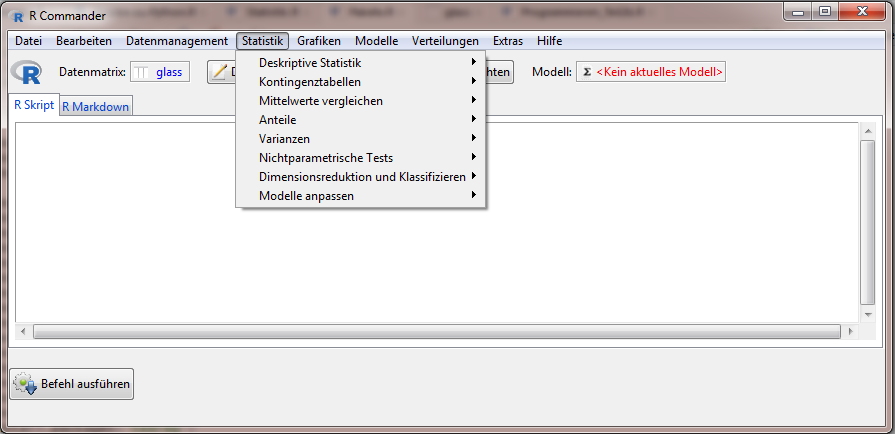
]

---

## Statistik: Effektstärken und Stichpobenplanung

#### Welche Stichprobengröße wird benötigt,<br>damit eine Mittelwertsdifferenz mit einer bestimmten Effektstärke signifikant wird?

Es geht um vier Größen – sind drei bekannt, kann die vierte bestimmt werden.

* **Stichprobengröße** (n)

* **Effektstärke**

* **Signifikanzniveau** = P (*Typ I-Fehler*) = Wahrscheinlichkeit, einen Effekt nachzuweisen,den es „in Wirklichkeit“ nicht gibt.  
Üblich sind 5% (auch 1%, 0,1%, 10%, …)

* **Teststärke** (power) = 1 – P (*Typ II-Fehler*) = Wahrscheinlichkeit, einen Effekt nachzuweisen, den es „in Wirklichkeit“ gibt.  
Üblich ist 80%


---

## Statistik: Effektstärken und Stichpobenplanung

.pull-left[
R-Pakete:
* **compute.es** zur Berechnung von Effektstärken
* **pwr** zur Stichprobenplanung

```{r pwr, eval = FALSE, echo = TRUE}
library(compute.es)
library(pwr)

ttest <- t.test(topalbums$final_score ~
                  topalbums$ueber5)
Effekt <- tes(ttest$statistic, 1300, 1700,
              verbose = FALSE)
pwr.t.test(n = NULL, 
           d = Effekt$d, sig.level = 0.05, 
           power = 0.8, type = "two.sample",
           alternative = "two.sided")
```
]

.pull-right[
### Welche Fallzahl n, <br>damit t-Test sig. wird?

```{r, ref.label = "pwr"}
```

]

---

.pull-left[
### Animationen mit gganimate
* Datenquelle: *gapminder*-Paket
* **Hans Rosling**: Seine Videos lohnen sich!

#### R-Paket: gganimate
* ursprünglich von **David Robinson**
* stark überarbeitet von **Thomas Lin Pedersen**
<br>
* Wohlstand (GDP, Pro-Kopf-Einkommen) und Lebenserwartung im Zeitverlauf
* 1952 – 2007; Daten in 5er-Schritten; <br>gganimate „glättet“ durch Interpolation
* Grafik enthält Informationen über einzelne Länder (Farben), Bevölkerung (Größe der Blasen) und Kontinente (Unterdiagramme = "Facetten" bzw. facets)

]

.pull-right[
```{r, echo = FALSE, message = FALSE, warning = FALSE, cache = TRUE}
# Code von Thomas Lin Pedersen
# https://github.com/thomasp85/gganimate/wiki/Gapminder

library(gapminder)
library(ggplot2)
library(gganimate)

ggplot(gapminder, aes(gdpPercap, lifeExp, size = pop, colour = country)) +
  geom_point(alpha = 0.7) +
  scale_colour_manual(values = country_colors) +
  scale_size(range = c(2, 12)) +
  scale_x_log10() +
  facet_wrap(~continent) +
  theme_bw(base_size = 17) +
  theme(legend.position = 'none') +
  labs(title = 'Year: {frame_time}', x = 'GDP per capita', y = 'life expectancy') +
  transition_time(year) 
```

]

---


## Datentypen in R

Datentyp | Details
---------|---------
Atomare Vektoren | logisch: TRUE, FALSE <br> numerisch: integer, double <br> character (Text)
Vektoren mit speziellen Attributen | Faktoren: Text mit festgelegten Kategorien (*factors*) <br> Datum (*date*), Datum-und-Zeit (*date-times*), Zeitintervalle (*durations*)
Mehrdimensionale Vektoren | Matrizen: zwei Dimensionen - Zeilen und Spalten <br> Arrays: Erweiterung von Matrizen, n Dimensionen
Listen | flexible Datenspeicher <br> können unterschiedliche Datentypen enthalten
Datensätze <br> *data frames* | für "rechteckige" Daten, d. h. Vektoren gleicher Länge


---

## ggplot2: Leicht gemacht mit esquisse!

.pull-left[
```{r}
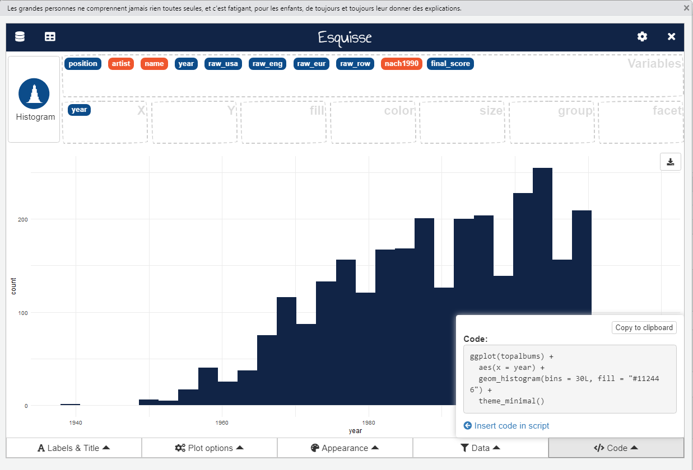
```
]

.pull-right[
* Grafische Nutzeroberfläche:<br>ggplot2-Diagramme interaktiv erstellen

* Variablen mit der Maus in Felder ziehen, um sie Ästhetiken zuzuordnen

* R-Code abrufen oder Diagramm direkt verwenden

* Start: per Code oder als RStudio-Addin  
`esquisse::esquisser()`

```{r, eval = FALSE}
# install.packages("esquisse")
esquisse::esquisser()
```

]


---
layout: false
class: hide-footer, hide-count

# .green[Viel Erfolg bei Ihren Datenanalysen!]

.pull-left[
```{r, fig.align = "center", out.width = "100%", out.height = "100%"}

```
]

.pull-right[
```{r, fig.align = "center", out.width = "100%", out.height = "100%"}

```
]

.pull-left[
.blue[**
Wolf Riepl  
Profile auf LinkedIn und Xing  
https://statistik-dresden.de/  
**]]

.pull-right[
.blue[**
.right[Youtube: StatistikinDD]
.right[Twitter: @StatistikInDD]
.right[https://www.facebook.com/statistikdresden]
**]]
