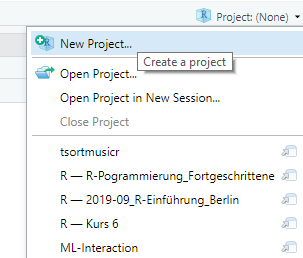
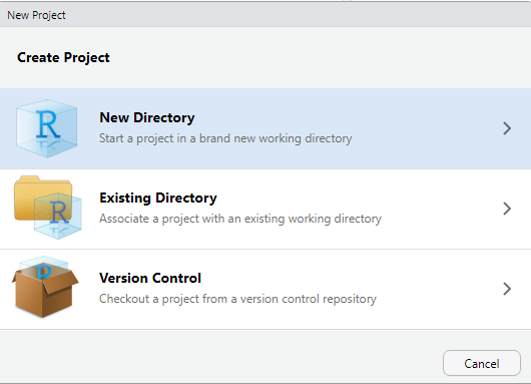
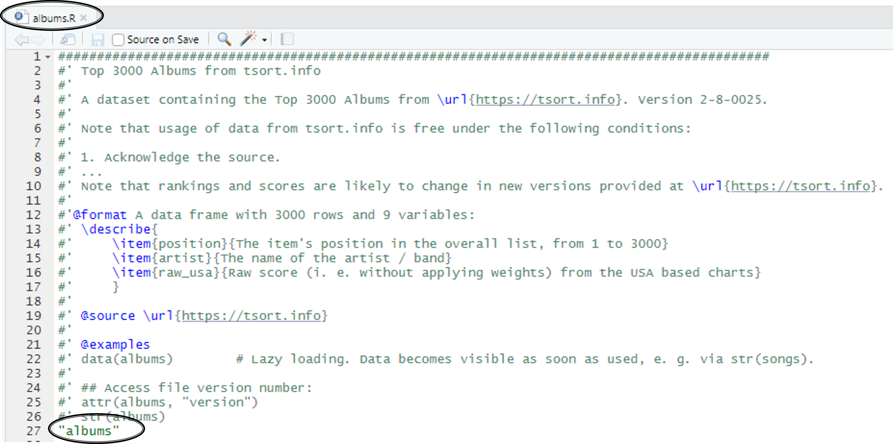

class: agenda, hide-footer

```{r, include=FALSE}
options(htmltools.dir.version = FALSE, htmltools.preserve.raw = FALSE) # seit rmarkdown 2.6
knitr::opts_chunk$set(echo = FALSE, comment = "")
# options(htmltools.dir.version = FALSE)
# library(reticulate) # Damit ein Python-Code-Block möglich ist, trotz eval = FALSE!
library(fontawesome)
library(knitr)
library(tidyverse)
library(chartmusicdata)
```

# Agenda

### .blue[*1. Why Bother creating Your Own Package?*]

### 2. Quick Start: A First Package in 2 Minutes

### 3. Integrating and Documenting Functions

### 4. Outlook - Further Topics

---

layout: true

# Why Bother creating Your Own Package?

---

```{r}

```

Source: https://dilbert.com/strip/2017-01-02

---

## You should consider creating a package if you …

.large[
* … Want to easily reuse code
* … Spend time copying and pasting functions across files
* … Need to organize your code in a central place
* … Collaborate with others on ongoing projects
* … Want to standardize your code (e. g. consistent plot themes)
* … Want to document your functions in a human-friendly way
* … Want to manage, share and document data in a central place
]

Source: Tweet by Caitlin Hudon (expanded)

https://twitter.com/beeonaposy/status/1115772283937804289

---

## "This is for more advanced programmers than me!"

.large[

Which conditions do I need to fulfil in order to create my own R package?

.pull-left[

You can create an R package if …

>*… you have written at least one line of R code in your career so far.*

see Sebastién Rochette, thinkr  
colleague of Colin Fay

https://www.r-bloggers.com/rmd-first-when-development-starts-with-documentation/

]]

.pull-right[
```{r, out.width = "80%", out.height = "80%"}

```
]


---

## Package vs. User-defined Functions outside a Package

.pull-left[
```{r, out.width = "85%", out.height = "85%"}

```

]

.pull-right[
### User-defined functions in (several) scripts

.large[
* Scripts need to be executed in every R session to make the functions available

* Functions clutter your global environment

* Documentation: Comments in scripts?  
Confusing for colleagues and future me
]]

---

## Package vs. User-defined Functions outside a Package

.pull-left[
```{r, out.width = "82%", out.height = "82%", fig.align = "left"}


```

]

.pull-right[
### Functions in R packages

* No need to run scripts: `library(package)`
* Functions don‘t clutter your environment
* One central place to manage functions
* Recommended: version control (git / SVN)

#### Documentation

* Structured help files just like in other packages
* Context menues for a quick overview  
  -> Use prefix for similar functions
* Provide application examples
* Optional: documented data; vignettes

]

---

class: agenda, hide-footer
layout: false

# Agenda

### 1. Why Bother creating Your Own Package?

### .blue[*2. Quick Start: A First Package in 2 Minutes*]

### 3. Integrating and Documenting Functions

### 4. Outlook - Further Topics

---

layout: true

# Quick Start: A First Package in 2 Minutes

---

## First R Package - New RStudio Project

.pull-left[
```{r, out.width = "70%", out.height = "70%"}

```
]

.pull-right[
```{r}

```

.large[**Create package in new directory**]

]

---

## First R Package - New RStudio Project

.pull-left[
```{r}

```
]

.pull-right[
<br><br><br><br><br>
.Large[
* Project type: *R Package*

* Later we'll use <br>*R Package using devtools*<br> for more convenient settings]
]

---

## First R Package - New RStudio Project: R Package

.pull-left[
```{r}

```
]

.pull-right[
Setting | Description
--------|------------
Type | Package <br> *Alternative: Package w/ Rcpp <br>(C++ Code)*
Source Files | Include scripts
Git repository | Version control
renv | Project receives its own package folder; protects from breaking changes in package updates; may be useful in production; predecessor: packrat
]

---

## First R Package: Minimal File Structure

.pull-left[
```{r}

```

]

.pull-right[

File | Description
-----|------------
.Rbuildignore | Files to be excluded from bundled package
DESCRIPTION | Metadata
xxx.Rproj | Project file; RStudio specific <br> (no need to edit)
NAMESPACE | Ensures package "plays nicely" with other packages; <br> e. g. which functions are visible to outside users

**Two folders**

* man: Documentation
* R: Code (scripts)

]

---

## Creating Our First Package: Build

.pull-left[
.Large[
* *Build* tab next to Environment / <br> History / ...

* First package installation: <br>**Install and Restart**

* Package gets installed!
]]

.pull-right[
```{r}
include_graphics("libs/_Images/RStudio-Install-Restart.png")

```
]

---

## Creating Our First Package: Build

.large[**Build -> Install and Restart:** Package gets installed]

.pull-left[
```{r}

```
]

.pull-right[
```{r}

```
]

* RStudio starts a new session and attaches the package using `library()`
* Example function `hello()` ready to use
* `hello()` function **not** in Global Environment - just like in other packages!

---

## Creating Our First Package: Build

.pull-left[
.large[**Build -> Install and Restart:** Package gets installed

* Example function `hello()` ready to use
* `hello()` function **not** in Global Environment - just like in other packages!

**Is the function documented, is there a help page?**

`?hello`
]]

.pull-right[
```{r}

```
]

---

## Creating Our First Package: Build

.pull-left[
```{r, out.width = "85%", out.height = "85%"}

```
]

.pull-right[
#### Where does this documentation come from?

Folder `man/hello.Rd`
```{r, out.width = "90%", out.height = "90%"}

```
]

---

## Five States of R Packages

.Large[
* Source Package

* Bundled Package (intermediate state)

* Binary Package

* Installed Package

* Loaded Package
]

---

## Package State: Source Code vs. *Bundled* File

.pull-left[
.content-box-green[

### Source Package

* Development version
* Files on author's machine
* Folder structure as seen:
  + R/
  + man/
  + DESCRIPTION
  + NAMESPACE
  + ...
]]

.pull-right[
.content-box-blue[
### Bundled Package

* Compressed to a single file
* File extension: *.tar.gz*
  + .tar Bundled to a single file
  + .gz  gzip compression
* When de-compressed: similar to source files, but not identical!
  + Vignettes are built: output format
    + Outputs: HTML or PDF
    + Source: Markdown or LaTeX
  + Files in .Rbuildignore left out
* **Not very useful: intermediate state**
]]

---

## Package State: Source Code vs. *Binary Package*

.pull-left[
.content-box-green[

### Source Package

* Development version
* Files on author's machine
* Folder structure as seen:
  + R/
  + man/
  + DESCRIPTION
  + NAMESPACE
  + ...
]

.right[
```{r}
fa("arrow-right", height = "3em", width = "3em")
```
]]


.pull-right[
.content-box-blue[
### Binary Package

* File format to pass on to other R users
* Installation **works without dedicated tools** for package creation
* Common format on CRAN
]

.content-box-green[
.large[**Installation from source ...**]

... may require dedicated software: .large[**Rtools**]

* possibly a compiler e. g. for C++
* possible Gtk+, e. g. RGtk2, Cairo, cairoDevice
]]

---

class: agenda, hide-footer
layout: false

# Agenda

### 1. Why Bother creating Your Own Package?

### 2. Quick Start: A First Package in 2 Minutes

### .blue[*3. Integrating and Documenting Functions*]

### 4. Outlook - Further Topics

---

layout: true

# Integrating and Documenting Functions

---

## Data: The chartmusicdata Package

.pull-left[
#### https://tsort.info/ "The World's Music Charts"
  + Songs and albums from 1900 to 2018
  + Scoring system well suited for entries up to about 2012

#### https://chart2000.com/ "Music Charts 2000 - 2021"
  + Scoring system better suited for newer entries

#### Install from github

```{r, eval = FALSE, echo = TRUE}
# install.packages("devtools")
library(devtools)
install_github("fjodor/chartmusicdata")
```

```{r}
library(chartmusicdata)
data("topalbums")
```
                        
 
]

.pull-right[

Data | Source: tsort.info
----------|-------
charts | All songs and albums from tsort.info from 1900 to 2018
topsongs | Top 5000 Songs
topalbums | Top 3000 Alben

<br><br>

Data | Source: chart2000.com
----------|-----------------------
songs2000 | Top 50 songs for every month from Jan 2000 to Jun 2021
albums2000 | Top 50 albums for every month from Jan 2000 to Jun 2021

]
---

## The songs2000 Data

```{r, echo = TRUE, eval = FALSE}
head(songs2000[, 1:7], n = 3)
```

```{r, echo = FALSE, eval = TRUE}
head(songs2000[, 1:7], n = 3) |> knitr::kable()
```

--

.pull-left[
* Top 50 songs for every month from Jan 2000 to Jun 2021
* position: total rank from 1 to 50
]

.pull-right[
* artist: name of artist / band
* song: song title
* indicativerevenue: estimated revenue across whole music chain in thousands of dollars
]

---

## Creating a Package to Work with this Data: tsortmusicr

.pull-left[
```{r, out.width = "90%", out.height = "90%"}

```
]

.pull-right[

* Navigation: New Project - <br> **R Package using devtools** - New Directory

* Leave *git* and *renv* disabled to keep it simpler

.content-box-grey[
You can also use  

`usethis::create_package(path)`
]

* If you accidentally selected *R Package*, then delete the example files in the *man* and *R* folders

]

---

## Our First Function in the New Package

Idea:

* User specifies a band
* Function chooses a random song of that band (artist) and displays it in the console

.content-box-green[
`# Set up R script`  
`library(devtools)`  
`use_r("random_song.R")`
]

```{r, echo = TRUE}
random_song <- function(artist = "Taylor Swift", data = songs2000) {
	banddata <- data[data$artist == artist, ]
	song <- base::sample(banddata$song, 1)
	paste0("Randomly selected song by ", artist, ": ", song)
}
```

---

## Documenting Our Function

.Large[

* Save `random_song.R`
* Build -> Install and Restart (alternative: *Build - More - Load All / Ctrl + Shift + L *)
* Test function
* `?random_song` -> Help is missing

.center[.blue[
> Documentation is a vital aspect of any R package.
]]]

---

## Object Documentation

.large[
Help to be called using `?function` or `help(function)`

#### What object documentation can and cannot do:

* Works like a dictionary

* .green[**Useful when you want to look up a specific term (a function)**]

* .red[**Not useful when you look for a new term (a new function) that you cannot yet name!**]

  + Vignettes are more suitable then
  
]

---

## Object Documentation: File Formats and Tools

.large[
Standard method to document R packages: **.Rd files**

* folder: **/man**

* Special syntax (similar to LaTeX)

* **.Rd** format is transformed to HTML, Text, PDF

* It is tedious to manually create **.Rd** files

* .green[**Better: use *roxygen2* to create .Rd files**]
]

---

## Object Documentation: File Formats and Tools

.large[Recommeded Tool for creating .Rd files: **roxygen2 R package**

* Code and documentation are linked and managed within the same file

* Changes in code -> you are reminded to also update documentation

* **roxygen2** cleverly detects objects -> no need to write *all* standard building blocks manually

* **roxygen2** abstracts away some differences in documentation between object types -> <br> user needs to learn fewer details

* **roxygen2** also manages NAMESPACE
]

---

## Object Documentation: Workflow

.large[
* Include roxygen comments in R scripts

* Update documentation:
  *Ctrl + Shift + D* or *Build - More - Document* or `devtools::document()`

* roxygen2 creates .Rd files based on roxygen comments

* Test documentation via `?function`

* Rinse and repeat!

* roxygen comments always start with **#'**

]

---

## Object Documentation: roxygen2

roxygen Code | Description | Example: function `random_song()`
-------------|-------------|----------------------------------
#' First line | Function title | #' Random song
#' <br> #' More text | Description | #' <br> #' Displays a randomly selected song by a specified artist.
#' @param | Function parameter | #' @param artist Artist / band as string.
#' @return | Return value | #' @return string: Title of a randomly selected song by {artist}.
#' @examples | Examples | #' examples `random_song()` <br> #' @examples `random_song("Elvis Presley")` <br> #' @examples `random_song(artist = "Eminem", data = songs2000)`
#' @export | Adds function to NAMESPACE <br> Makes it accessible to user | *No parameters; specify exactly like so:* <br>#' @export

---

## Object Documentation: Our First Help Page

.pull-left[
```{r}
include_graphics("libs/_Images/random-song-roxygen.png")
```

More about roxygen2: https://cran.r-project.org/web/packages/roxygen2/vignettes/rd.html
]

.pull-right[
.large[`?random_song`]

```{r}

```
]

---

## usethis: Package Supporting Workflows

usethis: Function | Description
------------------|------------
`create_package(path)` | Creates an R package as an RStudio project; <br> creates DESCRIPTION and NAMESPACE
`use_mit_license() / use_gpl3_license()` | Puts specified licence in DESCRIPTION and adds a licence file LICENSE.md
`use_git() / use_github()` | Activates versioning locally / on github
`use_build_ignore(file / folder)` | Adds to *.Rbuildignore*: Files to exclude from package installation; <br> recommended to not edit manually (regular expressions)
`use_testthat()` | Prepares for automated unit tests: <br> places testthat package in DESCRIPTION / Suggests; <br> creates folder *tests/testthat* and file *testthat.R*

* For more functions see `?use_`
* *usethis* is attached alongside the *devtools* package

---

## DESCRIPTION

* Holds metadata: title, description, author(s) including Email address; licence

* Dependencies on other R packages:
  + **Imports / Depends**: Required packages; are installed alongside your package if missing  
    *Imports*: loads package ≠ library!	package::function  
    *Depends*: adds package to search path (like library)  
    **Recommended: Imports** - minimizes impact on global environment
	+ **Suggests**:	Recommended packages; package will work without them; they are **not** installed alongside your package; may contain data, needed for tests or only for one function
	+ `usethis::use_package()` to declare package dependency

* Version numbers of abovementioned packages and of R itself; version of your package

Details: https://r-pkgs.org/description.html

---

## Rethink: Working in Scripts vs. Creating a Package

Task | Working in R Scripts | Creating a Package
-----|----------------------|-------------------
Use functions from an extension package | `library(ggplot2)` or `require(ggplot2)` <br> Use functions directly, e. g. <br> `ggplot(mtcars, aes(...))` | ~~`library() / require()`~~ Never! <br> DESCRIPTION: *Imports / Depends*; `usethis::use_package()`<br> If *Imports* is used: Explicitly specify package in each function call, e. g. `ggplot2::ggplot(mtcars, ggplot2::aes(...))`
Use your own functions | Functions are objects in your *Global Environment*<br>Define functions from a script: `source()` | Functions **not** in Global Environment (source of confusion!) <br> Quickly update functions using `devtools::load_all()` or <br> **Ctrl + Shift + L** or *Build - Load All* <br> Alternative (slower): *Build - Install and Restart*

---

class: agenda, hide-footer
layout: false

# Agenda

### 1. Why Bother creating Your Own Package?

### 2. Quick Start: A First Package in 2 Minutes

### 3. Integrating and Documenting Functions

### .blue[*4. Outlook - Further Topics*]

---

layout: true

# Outlook - Further Topics

---

.pull-left[
## Literature

.large[Recommended: **R Packages** by **Hadley Wickham** and **Jenny Bryan**]
* Available for free at: https://r-pkgs.org/ - Work in progress
* 2nd edition, quite different to Hadley's 1st book!

.large[Very comprehensive: *Writing R Extensions*]  
https://cran.r-project.org/doc/manuals/r-release/R-exts.html

.large[More ...]
* https://devguide.ropensci.org/
* https://kbroman.org/pkg_primer/
* https://www.emilhvitfeldt.com/post/2018-09-02-usethis-workflow-for-package-development/
]

.pull-right[
```{r, out.height = "80%", out.width = "80%"}

```

]

---

## Integrating and Documenting Data

* Data are often just as useful in a package as functions

* Documentation similar, but somewhat different

* There are numerous pure data packages, e. g. *datasets* (Base R), *nycflights13*, *gapminder*

* Data stored in subfolder `data/`

* Helper function: `usethis::use_data()`

* Must be documented
  + Separate file: script `data.R`, stored in `R/` folder
  + roxygen tags: @format, @source
  + End of script, without roxygen comment: *"name-of-dataset"*

* Access help file: `?data`, e. g. `?songs2000` 


---

## Integrating and Documenting Data

```{r, out.width = "80%", out.height = "80%"}

```

---

## Vignettes: More General Package Documentation

* Motivation: Introduction to package or a specific topic

* Easier to find than documentation about specific functions

* R Markdown documents

* Advantage:
  + Mix R code and results (output, graphics)
  + User sees both immediately; no need to execute R code first

---

## Vignettes: More General Package Documentation

* Get started: `usethis::use_vignette("my-vignette")`
  + Creates folder *vignettes/*; creates R script *vignettes/my-vignette.Rmd*
  + Adds to DESCRIPTION: *knitr* in *Suggests* and *VignetteBuilder*

* .large[***Install and Restart*** does **not** build vignettes!]
* .large[**`devtools::install_github()`** does **not** build vignettes!]

* Build package that includes vignettes:
  + `devtools::build()` creates a *package bundle* including vignettes -> install locally from bundle
  + `devtools::install_github("repo/package", build_vignettes = TRUE)` installs package and builds vignettes

---

<!-- ## Checks and Tests: R CMD check / `devtools::check()` -->

<!-- * Compulsory when publishing on CRAN -->
<!-- * Useful even if no CRAN release is planned -->
<!-- * Can be frustrating at first -->
<!-- * .green[Recommended: Run often] -->

## Automated Tests / Unit Tests

* Set up testing environment: `use_testthat()`
  + creates folder: *tests/testthat*
  + creates R script: *tests/testthat.R*
  + adds *testthat* to *Suggests* in DESCRIPTION

* Create specific test: `use_test("function.R")`

* testthat `expect_` functions: Compare **Actual Result** to **Expectation**
  + `expect_equal(), expect_output()`
  + `expect_message(), expect_warning(), expect_error()`
  + see `?expect_`
  
---

## A Last Word on Documentation ...

```{r}

```

Source: https://xkcd.com/1343/
