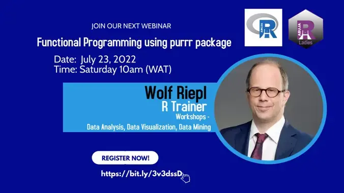

class: hide-footer, hide-count
background-color: #EFEFEF

```{r, include = FALSE}
library(fontawesome)
library(tidyverse)
library(knitr)
knitr::opts_chunk$set(echo = TRUE, comment = "")

options(htmltools.dir.version = FALSE)
xaringanthemer::style_mono_accent(title_slide_background_color = "#EDF4FB",
                                  title_slide_text_color = "#000000",
                                  base_font_size = "18px")
Sys.setenv(LANG = "en")

# Trick to suppress lapply's list output
# Source: https://stackoverflow.com/questions/54300147/suppress-list-notation-in-rmarkdown-from-lapply

def <- knitr::knit_hooks$get("output")
knitr::knit_hooks$set(output = function(x, options) {
  x <- def(x, options)
  ifelse(!is.null(options$suppress), gsub(pattern = "```.*```", "", x), x)
})
```


.pull-left[

# Functional Programming

## .center[Using]

.pull-left[
<br><br>
```{r, echo = FALSE, fig.align = "center"}
knitr::include_graphics("libs/_Images/logo-purrr.png")
```
]

.pull-right[
<br><br>
```{r, echo = FALSE, fig.align = "center"}
knitr::include_graphics("libs/_Images/logo-R.png")
```
]]

.pull-right[
<br><br><br><br><br><br><br><br>

```{r, echo = FALSE, fig.align = "center", out.width = "100%", out.height = "100%"}

```
]

.left-column[<br><br>`` ``July 23, 2022]
.right-column[
.pull-left[Wolf Riepl - R Trainer]
.pull-right[Youtube: StatistikinDD]
.pull-left[https://statistik-dresden.de]
.pull-right[Twitter: @StatistikinDD]
]

---

# Let's bring on the Magic!

.pull-left[

]

--

.pull-right[

```{r, echo = FALSE, fig.align = "center"}
knitr::include_graphics("libs/_Images/logo-purrr.png")
```
]

--

### We will use magic two-fold:

* **The magic of the purrr package**

* **Magic numbers to generate messages from random letters**

---

# What We Want to Achieve

## Iterate over Several Vectors in One R Command

```{r magic-message, echo = FALSE}

seeds <- c(2219868, 110454, 639, 1750, 690, 9487)
word_lengths <- c(5, 4, 2, 3, 2, 4)
choices <- c(rep(list(letters), 5), list(0:9))

magic_message <- function(seed, choices, word_length) {
  set.seed(seed)
  sample(choices, size = word_length, replace = TRUE) |>
    paste(collapse = "") |>
    stringr::str_to_title()
}

```


```{r pmap-chr}

purrr::pmap_chr(   #<<
  list(seeds, choices, word_lengths),
  magic_message) |>
cat()

```

---

# Let's Go Step By Step

.pull-left[
### Drawing Random Letters ...

```{r}

set.seed(1)  #<<
sample(letters, size = 5, replace = TRUE) |>
  paste(collapse = "")

set.seed(2)  #<<
sample(letters, size = 5, replace = TRUE) |>
  paste(collapse = "")

```

** As Magicians, we should know some magic seeds ... **

]

--

.pull-right[

### Knowing a Few Magic Seeds ...

```{r}
set.seed(1982138)  #<<
sample(letters, size = 4, 
       replace = TRUE) |>
  paste(collapse = "") |>
  stringr::str_to_title()

set.seed(942538)  #<<
sample(letters, size = 4, 
       replace = TRUE) |> 
  paste(collapse = "") |>
  stringr::str_to_title()

```

Is this code elegant, <br>especially when we create more words?

]

---

# From Copy & Paste to Our Own Function

### When to Write a Function

*You should consider writing a function whenever you’ve copied and pasted a block of code more than twice <br>(i. e. you now have three copies of the same code).*<br><br>
.right[Hadley Wickham and<br>Garrett Grolemund<br>in **R for Data Science** (R4DS)]

--

.pull-left[
```{r}

magic_message <- function(seed) {  #<<
  set.seed(seed)
  sample(letters, 
         size = 4, 
         replace = TRUE) |>
  paste(collapse = "") |>
  stringr::str_to_title()
}

```
]

--

.pull-right[

### Applying the Function


```{r}

magic_message(1982138)
magic_message(942538)
```
]


---

# Applying the Function More Elegantly

```{r}
seeds <- c(1982138, 942538)
lapply(seeds, magic_message)  #<<
sapply(seeds, magic_message)  #<<

lapply(seeds, magic_message) |> unlist()  #<<
```


---

# Enter purrr

## Specify Data Type of Return Value 

.pull-left[


* `map()` corresponds to `lapply()`: returns a list
* `map_` variants return other data types
* `map_chr(), map_int(), map_dbl(), map_lgl()` etc.

For now, we will stick with **`map_chr()`**.

]

.pull-right[

```{r}
seeds <- c(1982138, 942538)
lapply(seeds, magic_message)

library(purrr)
map_chr(seeds, magic_message) #<<
```

]

---

# purrr: Iterating over Two Vectors

.pull-left[

### Love is just a four-letter-word ...

So far, our `magic_message()` function can only return 4-letter-words:

```{r}
magic_message <- function(seed) {
  set.seed(seed)
  sample(letters,
         size = 4,  #<<
         replace = TRUE) |>
  paste(collapse = "") |>
  stringr::str_to_title()
}
```

**What if word lengths differ?**
]

--

.pull-right[

### Flexible word lengths

Let's change that:

```{r}
magic_message <- function(seed,
        word_length) {   #<<
  set.seed(seed)
  sample(letters,
         size = word_length,  #<<
         replace = TRUE) |>
  paste(collapse = "") |>
  stringr::str_to_title()
}

```

]

---

# purrr: Iterating over Two Vectors

## Let's apply the new function

### `map2(.x, .y, .f, ...)`


```{r}
seeds <- c(2219868, 110454)
word_lengths <- c(5, 4)

map2_chr(seeds, word_lengths, #<<
         magic_message)
```

--

#### What if we have more than 2 vectors to iterate over?

#### There is no `map3()` function in purrr

---

# purrr: Iterating over Multiple Vectors

## Adding Flexibility: Choices to Sample From

.pull-left[
Remember the original *"magic message"*?

### `Happy Bday To You In 2022`

So far, our `magic_message()` function can only output letters, not numbers.

#### Let's change that.
]

--

.pull-right[
### Flexible choices

```{r}
magic_message <- function(seed, 
        choices, word_length) { #<<
  set.seed(seed)
  sample(choices, #<<
         size = word_length, #<<
         replace = TRUE) |>
    paste(collapse = "") |>
    stringr::str_to_title()
}
```

]
---

# purrr: Iterating over Multiple Vectors

### `pmap(.l, .f, ...)`

**`.l = list of vectors`**

```{r}
seeds <- c(2219868, 110454, 639, 1750, 690, 9487)
word_lengths <- c(5, 4, 2, 3, 2, 4)
choices <- c(rep(list(letters), 5), list(0:9))

```

--

.pull-left[
```{r}
purrr::pmap_chr(   #<<
  list(seeds, choices, word_lengths),  #<<
  magic_message) |>
cat()

```
]

.pull-right[
```{r, eval = FALSE}

purrr::pmap_chr(   #<<
  # list of vectors to iterate over
  list(seeds, choices, word_lengths),
  
  # function that takes 3 arguments
  magic_message) |>

# remove quotes around each word
cat()

```

]
---

# purrr: Learning More

.left-column[
```{r, echo = FALSE}
include_graphics("libs/_Images/logo-purrr.png")
```
]

.right-column[
**RStudio CheatSheet** https://raw.githubusercontent.com/rstudio/cheatsheets/main/purrr.pdf

**R for Data Science (R4DS)**, Chapter 21: Iteration https://r4ds.had.co.nz/

**Jenny Bryan**, R Package *repurrrsive:*
  + https://github.com/jennybc/repurrrsive
  + https://jennybc.github.io/purrr-tutorial/

**Charlotte Wickham**
  + https://github.com/cwickham/purrr-tutorial
  + https://resources.rstudio.com/wistia-rstudio-conf-2017/happy-r-users-purrr-tutorial-charlotte-wickham

**Colin Fay**: Vous allez aimer avoir {purrr} (Artile in English)  
https://colinfay.me/happy-dev-purrr/
]
---
layout: false
class: hide-footer, hide-count

# .green[Now Apply Your Own Magic ... <br> .center[... and Enjoy!]]

.pull-left[
```{r, echo = FALSE, fig.align = "center", out.width = "55%", out.height = "55%"}

```
]

.pull-right[
```{r, echo = FALSE, fig.align = "center", out.width = "100%", out.height = "100%"}
knitr::include_graphics("libs/_Images/coffee.jpg")
```
]

.pull-left[
.blue[**
Wolf Riepl  
Active on LinkedIn  
https://statistik-dresden.de/  
**]]

.pull-right[
.blue[**
.right[Youtube: StatistikinDD]
.right[Twitter: @StatistikInDD]
.right[https://www.facebook.com/statistikdresden]
**]]

