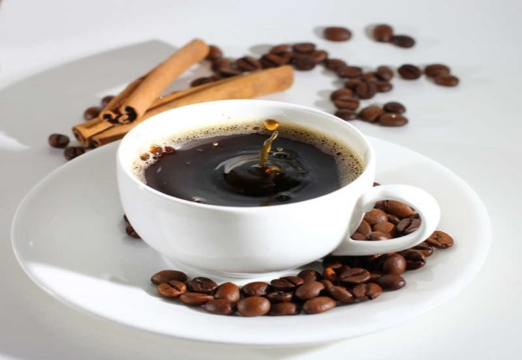

class: hide-footer, hide-count
background-color: #EFEFEF

```{r, include = FALSE}
library(fontawesome)
library(tidyverse)
library(knitr)
knitr::opts_chunk$set(echo = FALSE, comment = "")

options(htmltools.dir.version = FALSE)
xaringanthemer::style_mono_accent(title_slide_background_color = "#EDF4FB",
                                  title_slide_text_color = "#000000",
                                  base_font_size = "18px")
Sys.setenv(LANG = "en")

# Trick to suppress lapply's list output
# Source: https://stackoverflow.com/questions/54300147/suppress-list-notation-in-rmarkdown-from-lapply

def <- knitr::knit_hooks$get("output")
knitr::knit_hooks$set(output = function(x, options) {
  x <- def(x, options)
  ifelse(!is.null(options$suppress), gsub(pattern = "```.*```", "", x), x)
})
```


.pull-left[

# Functional Programming

## .center[Using]

.pull-left[
<br><br>
```{r, fig.align = "center"}
knitr::include_graphics("libs/_Images/logo-purrr.png")
```
]

.pull-right[
<br><br>
```{r, fig.align = "center"}
knitr::include_graphics("libs/_Images/logo-R.png")
```
]]

.pull-right[
<br><br>

### Let's Turn On the Magic!

```{r, fig.align = "center", out.width = "100%", out.height = "100%"}
knitr::include_graphics("libs/_Images/2022-07-23-Abuja-purrr.webp")
```
]

.left-column[<br><br>`` ``July 23, 2022]
.right-column[
.pull-left[Wolf Riepl - R Trainer]
.pull-right[Youtube: StatistikinDD]
.pull-left[https://statistik-dresden.de]
.pull-right[Twitter: @StatistikinDD]
]

---

# bla

---
layout: false
class: hide-footer, hide-count

# .green[Now Apply Your Own Magic ... <br> .center[... and Enjoy!]]

.pull-left[
```{r, fig.align = "center", out.width = "55%", out.height = "55%"}

```
]

.pull-right[
```{r, fig.align = "center", out.width = "100%", out.height = "100%"}

```
]

.pull-left[
.blue[**
Wolf Riepl  
Active on LinkedIn  
https://statistik-dresden.de/  
**]]

.pull-right[
.blue[**
.right[Youtube: StatistikinDD]
.right[Twitter: @StatistikInDD]
.right[https://www.facebook.com/statistikdresden]
**]]
